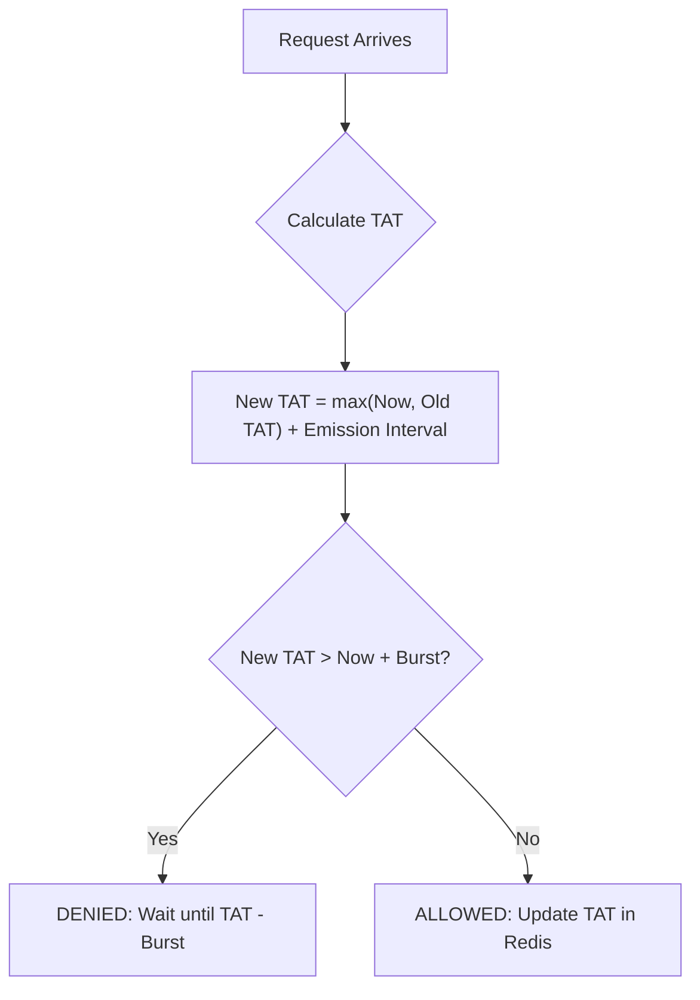

# Go Leaky Bucket Rate Limiter with Redis

[](https://github.com/alibazlamit/leaky_bucket_redis/actions/workflows/test.yml)
[](https://goreportcard.com/report/github.com/alibazlamit/leaky_bucket_redis)
[](https://pkg.go.dev/github.com/alibazlamit/leaky_bucket_redis)
[](https://opensource.org/licenses/MIT)

A high-performance **distributed rate limiter in Go** built using the **Leaky Bucket algorithm** and **Redis** as the backend.  
Ideal for APIs, microservices, and distributed systems that need **accurate request throttling** across multiple instances.

⭐ **If you find this library useful, please consider giving it a star! It helps others discover this project.** ⭐

---

## Why Use This Library?

While there are several rate limiters available for Go, this library specifically implements a strict **Leaky Bucket** algorithm via highly optimized atomic Lua scripts in Redis. This provides:

- **Exact Smooth Throttling:** Token buckets allow bursts; leaky buckets strictly smooth out requests to a constant, predictable rate.
- **Zero-Dependency Core:** Only depends on the official `go-redis` client, keeping your modules clean.
- **Sub-Second Precision:** Millisecond/nanosecond resolution ensures perfect timing between cross-server requests.
- **Fail-Open Fallback:** Designed so that if your Redis node suddenly becomes unreachable, it won't indefinitely block or take down your API.

---

## Features

- **Redis-Backed Distributed Limiting** – works across multiple Go servers
- **Precise Timing** – sub-second accuracy via nanosecond timestamps  
- **Atomic Lua Scripts** – ensures consistent rate control in Redis  
- **Context-Aware** – supports `context.Context` for cancellation & timeouts  
- **Production-Ready** – robust error handling and full test coverage  
- **Lightweight** – no dependencies beyond Go and Redis  

---

## Installation

```bash
go get github.com/alibazlamit/leaky_bucket_redis/v2@latest
```

> **Migration Note (v1 -> v2):** This module has been migrated to a `v2` module path to introduce significant algorithm improvements (GCRA) and framework adapters without breaking existing applications. 
> 
> - **New Users / Upgraders**: Please use the `github.com/alibazlamit/leaky_bucket_redis/v2` import path as shown above.
> - **Legacy Users (v1)**: If you are experiencing breaking changes from fetching `latest` on the old module path, please pin your application to `v1.0.0` (the pre-refactor stable release):
>   `go get github.com/alibazlamit/leaky_bucket_redis@v1.0.0`

**Requirements:**
- Go 1.22+
- Redis 6.0+

---

## How it Works: GCRA Algorithm

This library uses the **Generic Cell Rate Algorithm (GCRA)**, which is the industry standard for sophisticated rate limiting. It's more efficient than "fixed window" or "sliding log" algorithms because it requires only a single Redis key and provides nanosecond precision.



---

## Quick Start
Example (Plug & Play)

```go
package main

import (
    "context"
    "fmt"
    "time"

    leaky_bucket "github.com/alibazlamit/leaky_bucket_redis/leaky_bucket"
    "github.com/redis/go-redis/v9"
)

func main() {
    // 1. Initialize Redis (UniversalClient supported)
    client := redis.NewClient(&redis.Options{Addr: "localhost:6379"})
    defer client.Close()

    // 2. Create Limiter: 10 req/sec with burst of 5
    limiter := leaky_bucket.New(client, 10.0, leaky_bucket.WithBurst(5))
    ctx := context.Background()

    // 3. Allow check
    res, err := limiter.Allow(ctx, "user_123")
    if err != nil {
        panic(err)
    }

    if !res.Allowed {
        fmt.Printf("Rate limited. Retry after %.2s\n", res.WaitTime)
        return
    }

    fmt.Printf("Allowed! Remaining: %d\n", res.Remaining)
}
```

---

## Framework Support (Plug & Play)

Protect any route in your favorite framework with a single line:

### [NEW] Gin Middleware
```go
limiter := leaky_bucket.New(redisClient, 10.0)
r := gin.Default()
r.Use(leaky_bucket.GinMiddleware(limiter, leaky_bucket.ExtractIP))
```

### [NEW] Echo Middleware
```go
limiter := leaky_bucket.New(redisClient, 10.0)
e := echo.New()
e.Use(leaky_bucket.EchoMiddleware(limiter, leaky_bucket.ExtractIP))
```

---

## 🛠️ Advanced Customization

### Custom Error Responses
Customize what happens when a user is rate limited (e.g., return JSON or a custom HTML page).

```go
mw := leaky_bucket.Middleware(limiter, leaky_bucket.ExtractIP, 
    leaky_bucket.WithErrorHandler(func(w http.ResponseWriter, r *http.Request, res *leaky_bucket.Result) {
        w.WriteHeader(http.StatusTooManyRequests)
        fmt.Fprintf(w, "Chill out! Wait until %v", res.ResetTime)
    }),
)
```

### Monitoring & Metrics
Use the `WithOnLimit` hook to pipe data into Prometheus, Datadog, or your logs.

```go
mw := leaky_bucket.Middleware(limiter, leaky_bucket.ExtractIP,
    leaky_bucket.WithOnLimit(func(r *http.Request, res *leaky_bucket.Result) {
        metrics.Incr("rate_limit.exceeded", []string{"path:" + r.URL.Path})
        log.Printf("Rate limit hit by %s", r.RemoteAddr)
    }),
)
```

### Flexible Key Extraction
Extract keys from anywhere in the request:

```go
// By Header (e.g., API Key)
mw := leaky_bucket.Middleware(limiter, leaky_bucket.ExtractHeader("X-API-Key"))

// By Cookie
mw := leaky_bucket.Middleware(limiter, leaky_bucket.ExtractCookie("session_id"))

// Custom logic (e.g., Auth Token)
mw := leaky_bucket.Middleware(limiter, func(r *http.Request) string {
    return r.Context().Value("user_id").(string)
})
```

---

## API Reference

### `New(client redis.UniversalClient, rate float64, opts ...Option) *LeakyBucketRedis`

Creates a new **Redis-based rate limiter**.

| Parameter | Type | Description |
|------------|------|-------------|
| `client` | `redis.UniversalClient` | Supports `*redis.Client`, `*redis.ClusterClient`, etc. |
| `rate` | `float64` | Allowed requests per second |
| `opts` | `...Option` | Configure `WithBurst(int)` |

### `Allow(ctx context.Context, key string) (*Result, error)`

Checks if a request is allowed for a specific key.

- Returns `*Result` with `Allowed`, `WaitTime`, `Remaining`, and `Limit`.
- Fails open on Redis errors (returns `Allowed: true`).

### `Wait(ctx context.Context, key string) error`

Blocks until the request is allowed or the context is cancelled. Ideal for background workers.

---

## Use Cases

### 1. HTTP API Rate Limiting

```go
limiter := leaky_bucket.NewLeakyBucket(client, "api_global", 10.0)
wait := limiter.Allow(r.Context())
```

### 2. Per-User Request Throttling
```go
key := fmt.Sprintf("user_limit:%s", userID)
limiter := leaky_bucket.NewLeakyBucket(client, key, 5.0)
```

### 3. Background Jobs / Batch Tasks
```go
limiter := leaky_bucket.NewLeakyBucket(client, "batch_limit", 2.0)
```

---

## ⚙️ How it Works (GCRA Algorithm)

This library implements the **Generic Cell Rate Algorithm (GCRA)**, which is a mathematically sound approach to the Leaky Bucket algorithm. It store a single `Theoretical Arrival Time` (TAT) in Redis, making it:

1. **Memory Efficient:** Only 1 key per limit scope.
2. **Highly Precise:** Handles floating-point rates and burst capacity with nanosecond precision.
3. **Atomic:** Uses a single, high-performance Lua script.

Smooths bursts into a steady flow  
Works across multiple servers  
Atomic and thread-safe  

---

## Performance

| Benchmark | Ops/sec | Avg Time |
|------------|----------|-----------|
| `Allow` | 10,000 | ~150 µs/op |
| `Concurrent` | 5,000 | ~300 µs/op |

---

## Testing

Tests are hermetic and run using an in-memory Redis (`miniredis`), so **no external Redis server is required** to run them.

```bash
go test ./leaky_bucket -v
go test ./leaky_bucket -cover
```

Tests cover:
- Allow/Deny behavior  
- Redis failure tolerance  
- Context cancellation  
- Concurrency safety  

---

## Examples

In `examples/` directory:
- `http_api.go` → API rate limiting  
- `per_user_limiting.go` → user-based limits  
- `batch_processing.go` → throttled batch jobs  

Run an example:
```bash
go run examples/http_api.go
```

---

## 🤝 Contributing & Versioning

To ensure stability and predictability for all users, this repository strictly adheres to **Semantic Versioning** and a **Pull Request-based workflow**:

1. **No Direct Pushes to `main`**: All changes must be submitted via Pull Requests.
2. **Conventional Commits**: Please format your PR titles and commit messages using the [Conventional Commits](https://www.conventionalcommits.org/) specification (e.g., `feat: add new adapter`, `fix: resolve race condition`).
3. **Automated Releases**: Upon merging to `main`, a GitHub Action automatically calculates the next version (major, minor, or patch) based on your commit messages and automatically creates a new tagged Release.

Pull requests and issues are highly welcome! We'd love to have your contributions.

---

## 📄 License

MIT License – see LICENSE for details
